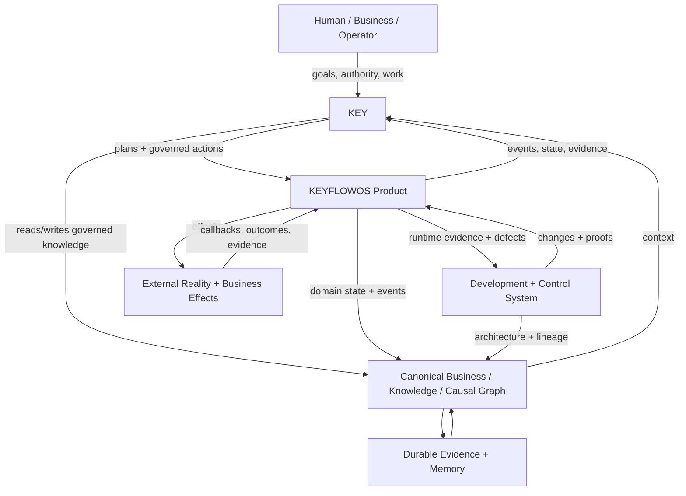
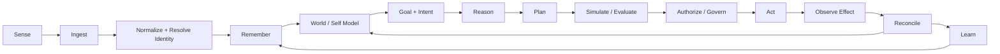
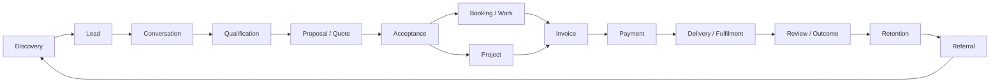
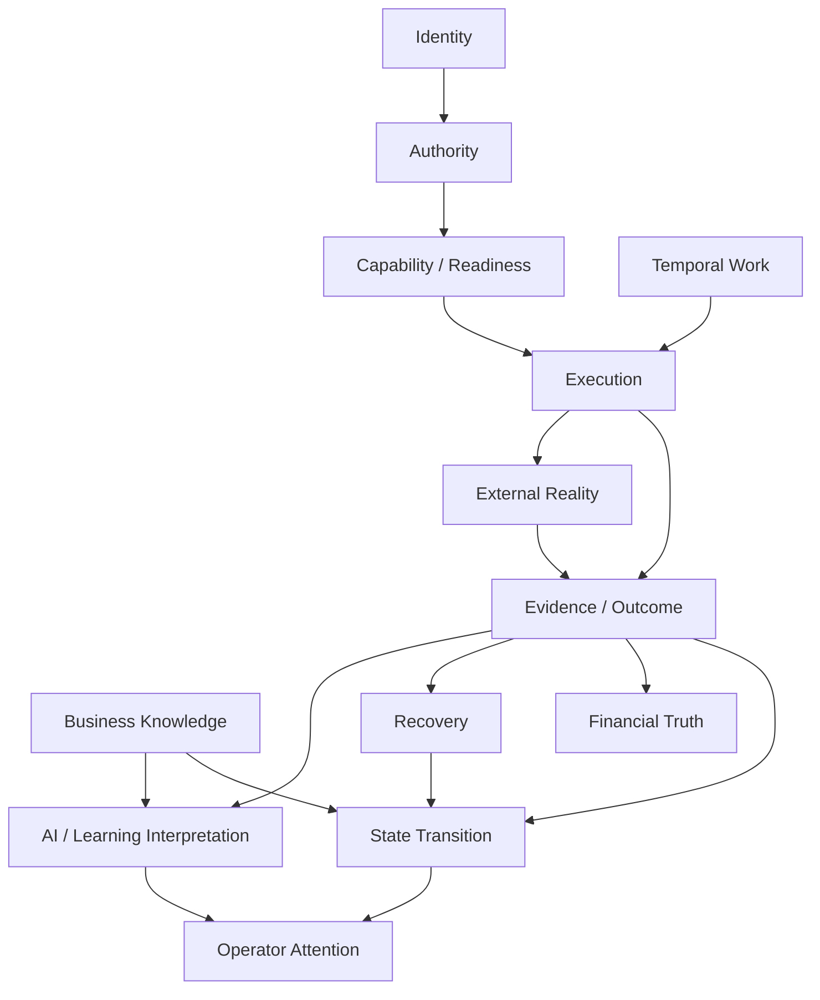

# KEYFLOWOS Living System Atlas

Status: FOUNDATION
Atlas ID: `KF-ATLAS-001`
Baseline main: `6fdffc26c7c7748d5c09900535c97c197864ab54`
Created: 2026-10-05

## Purpose

The Living System Atlas is the navigable semantic map of KEYFLOWOS, KEY, the business/runtime system they operate, and the development/control system that evolves them.

It does **not** replace code, generated architecture registries, durable intelligence, or the control plane. It is an indexed overlay that connects those sources so an agent or human can move from:

```
business goal
  -> journey
  -> kernel
  -> domain/capability
  -> execution path
  -> event/data/effect
  -> repository implementation
  -> proof
  -> development history
```

and back again.

The atlas exists to make the whole system understandable as one organism rather than as independent modules.

## Authority rule: the atlas is not a second truth system

Every node and edge must declare its evidence class.

| Evidence class | Meaning |
|---|---|
| `observed` | Reachable implementation or repository state directly supported by code/generated maps/control state. |
| `accepted` | Canonical architectural/programme decision recorded in durable repository intelligence. |
| `intended` | Target/design direction that is not yet implementation truth. |
| `derived` | Interpretation computed from observed/accepted evidence. |
| `historical` | Prior intent or prior implementation retained for lineage only. |
| `unknown` | The relationship is unresolved and must not be promoted to fact. |

Rules:

1. Current code is implementation evidence, not automatic proof of intended architecture.
2. Generated ownership is discovery evidence, not automatic semantic ownership.
3. A documented edge does not prove a reachable runtime edge unless execution evidence supports it.
4. Contradictions remain explicit; the atlas must never silently reconcile them.
5. Every important edge should eventually carry evidence, confidence, semantic owner, authority, and last verification.
6. Existing generated registries remain read-only inputs unless their generator is intentionally run.
7. No atlas update may weaken a gate, proof obligation, or production safety constraint.

## Atlas layers

The atlas is one graph with multiple zoom levels.

| Layer | Question answered |
|---|---|
| L0 Reality / Outcomes | What real-world state or business outcome exists? |
| L1 Product / Capabilities | What can KEYFLOWOS do? |
| L2 Journeys | How does value move end-to-end across domains? |
| L3 Kernels | What irreducible architectural laws own identity, authority, time, evidence, recovery, etc.? |
| L4 KEY Cognition | How does KEY perceive, remember, reason, plan, govern, act, and learn? |
| L5 Execution | What reachable path produces a state transition or external effect? |
| L6 Implementation | Which apps, packages, modules, files, entities, events, queues, providers, and infrastructure implement it? |
| L7 Development System | How do ChatGPT, Claude Code, Kimi Code, GitHub, review, CI, control-plane and human authority evolve the system? |
| L8 Evidence / Continuity | What proves current state, what is canonical, and how does the next agent recover context? |

## Master map



## KEY cognitive map

KEY should be represented as a governed cognitive loop, not as a single chat endpoint.



The cognitive map is deliberately separated into:

- perception/ingestion;
- identity and entity resolution;
- memory;
- world/business/system model;
- goals and intent;
- reasoning and planning;
- evaluation;
- authority/governance;
- tool/capability routing;
- action/effect;
- observation/evidence;
- reconciliation/recovery;
- learning.

No AI inference becomes authoritative business truth merely because KEY produced it.

## Product capability map

The atlas should connect business capabilities to the real modules and routes that implement them. Initial capability families include:

```
KEYFLOWOS
|- Identity / organisations / authority
|- CRM / relationship intelligence
|- Communications
|- Commerce / quotes / invoices / payments
|- Bookings / time
|- Projects / work
|- Finance / accounting / reconciliation
|- Social / content / growth
|- Presence / site / public surfaces
|- Documents / files / storage
|- Analytics / attribution / reporting
|- Connectors / integrations
|- Automation / temporal workflows
|- Governance / approvals / recovery
'- KEY
   |- context
   |- memory
   |- reasoning
   |- planning
   |- skills / capabilities
   |- autonomy
   |- evaluation
   |- voice / device
   '- learning
```

This is a semantic capability view. It must not be assumed to match the current folder tree one-to-one.

## Journey map

Journeys represent value crossing module boundaries.



Canonical journey IDs and their exact current count remain owned by durable intelligence. The atlas references them; it does not invent replacements.

## Kernel map

The atlas must expose the reusable laws underneath domain-specific implementations.



Domain state, derived state, evidence, control state, execution state, business outcome, financial truth, operator attention and AI interpretation must remain distinguishable.

## Microscopic execution trace

Every important runtime effect should be traceable through the same skeleton:

```
entry
-> authentication / tenant context
-> authority / capability / control
-> command or domain service
-> invariant checks
-> transaction boundary
-> canonical mutation
-> event/outbox/queue
-> worker/listener/scheduler
-> external provider effect
-> callback/result/evidence
-> reconciliation
-> derived projection
-> downstream consumer/operator surface
-> retry/replay/correction/cancellation/recovery
-> later feedback
```

A trace is incomplete if it only documents the happy path.

## Development-system map

The development system is itself a governed feedback loop and should be represented in the same graph.

```mermaid
flowchart LR
    OWNER[Human authority] --> CONTEXT[Canonical repo context]
    CONTEXT --> SELECT[Select bounded work]
    SELECT --> AGENT[ChatGPT / Claude Code / Kimi Code]
    AGENT --> BRANCH[Branch + implementation]
    BRANCH --> TEST[Focused proof]
    TEST --> PR[Pull request]
    PR --> REVIEW[Independent AI / human review]
    REVIEW --> CI[CI + gates]
    CI --> ADMIT[Admission decision]
    ADMIT --> MERGE[Merge]
    MERGE --> VERIFY[Post-merge verification]
    VERIFY --> CHECKPOINT[Durable checkpoint]
    CHECKPOINT --> CONTEXT
```



This map must expose:

- packet/state/health;
- source main and source head;
- branch/PR;
- scope ledger;
- proof obligations;
- review evidence;
- CI/admission status;
- merge authority;
- post-merge verification;
- current hold/blocker;
- production/provider safety state;
- exact next action.

## Cross-layer identity

The atlas becomes useful when the same IDs connect zoom levels.

Example:

```
JOURNEY-023
  -> uses KERNEL-TEMPORAL
  -> touches DOMAIN-AUTOMATION
  -> emits EVENT-X
  -> implemented-by FILE-A / FILE-B
  -> proved-by TEST-X
  -> affected-by FINDING-Y
  -> changed-by PR-Z
```

Likewise:

```
KEY decision
  -> goal
  -> evidence
  -> memory source
  -> authority
  -> plan
  -> capability
  -> action
  -> effect
  -> outcome
```

## Edge contract

Every material edge should converge toward the following record:

```yaml
id: EDGE-...
source: ...
target: ...
relation: implements|depends_on|emits|consumes|owns|derives|proves|changes|governs|recovers|causes
layer: L0-L8
evidence_class: observed|accepted|intended|derived|historical|unknown
evidence:
  - path: repository/path
    ref: optional commit/branch
semantic_owner: unresolved-or-canonical-id
authority: code|generated-map|canonical-intelligence|control-plane|human
confidence: high|medium|low|unknown
last_verified: YYYY-MM-DD
notes: optional
```

## Atlas views

The graph should render as focused views rather than one unreadable diagram:

1. **Whole-system view** — KEYFLOWOS + KEY + reality + development system.
2. **Capability view** — product/business capabilities and owning domains.
3. **Journey view** — end-to-end business/user outcomes.
4. **Kernel view** — cross-domain architecture laws.
5. **KEY cognition view** — perception, memory, reasoning, governance, action, learning.
6. **Execution view** — one reachable path including failures/recovery.
7. **Repository view** — modules/files/events/entities/infrastructure.
8. **Development view** — directives, agents, branches, PRs, gates, merge/checkpoint.
9. **Evidence view** — source-of-truth, projections, confidence, contradictions.
10. **Progress view** — completed/active/blocked/unbuilt/unverified by layer.

## Canonical inputs

The atlas should index, not duplicate, these existing sources:

- `architecture/system-overview.md`
- `architecture/repository-map.md`
- `architecture/dependency-map.md`
- `architecture/execution-paths.md`
- `architecture/data-model.md`
- `architecture/module-registry.md`
- `architecture/architecture-risks.md`
- `architecture/target-architecture.md`
- `architecture/migration-plan.md`
- `architecture/architecture.json`
- generated registries in `architecture/*.yaml`
- `docs/intelligence/` on the canonical intelligence branch
- `.agent-control/programme-state.yaml`
- `docs/development/EXECUTION_CONTROL_STANDARD.md`
- the programme DAG and packet contracts
- tests, CI and post-merge evidence

## Foundation scope

`KF-ATLAS-001` is intentionally a foundation, not a claim of full cartographic coverage.

Resolved in this tranche:

- define the atlas authority model;
- define layers;
- define KEY cognitive map;
- define product/journey/kernel/execution/development views;
- define cross-layer IDs and edge contract;
- create a machine-readable atlas manifest;
- connect the atlas to existing architecture memory.

Still required:

- deterministic ingestion of existing architecture registries;
- journey/kernel IDs from canonical intelligence;
- semantic-owner review separate from generated ownership guesses;
- external-service topology through deployment, permissions, retry and recovery;
- code-to-journey and PR-to-architecture reverse indexes;
- freshness/confidence automation;
- graph validation and anti-fabrication checks;
- visualization UI;
- atlas-aware task context assembly for ChatGPT/Claude/Kimi/KEY;
- continuous update hooks after admitted architecture-affecting changes.

No production deployment, provider effect, production data mutation, or application packet release is authorized by this atlas foundation.
