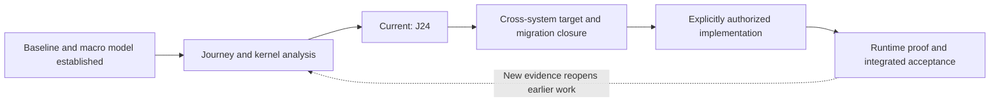

# KEYFLOWOS - Living Programme Map

> GENERATED VIEW, not another status authority.
> Checkpoint: `J24-PA-2026-09-16-01` | As of: 2026-09-16
> Regenerate: `python docs/intelligence/tools/build-programme-map.py`
> Verify freshness: append `--check`. Source: `handoff/CURRENT-STATE.yaml`.

**Current: J24 - J24_SAFE_CHANGE_CONVERGENCE_REVIEW**

Dossiers: **20/25 (80%)**. This is coverage, not app completion.
Tracked proof: **44 designed cases; 0 runner bindings; NOT_EXECUTED**.
Production changes authorized: **False**. Programme runtime proof recorded: **False**.
No whole-app completion percentage is established. Existing application code and historical test reports are not zeroed by this view.

## Programme route

## All canonical journeys

| Journey | Name | Current view | Recommendation |
|---|---|---|---|
| [J1](../../../docs/intelligence/journeys/KF-JOURNEY-001-BUSINESS-BIRTH.md) | Business Birth | Existing dossier | - |
| [J2](../../../docs/intelligence/journeys/KF-JOURNEY-002-KEY-REQUEST-GOVERNED-ACTION.md) | KEY Request → Governed Action | Existing dossier | - |
| [J3](../../../docs/intelligence/journeys/KF-JOURNEY-003-LEAD-CUSTOMER-CASH.md) | Lead → Customer → Cash | Provisional target alignment | KF-REC-053 |
| [J4](../../../docs/intelligence/journeys/KF-JOURNEY-004-BOOKING-SERVICE-PAYMENT.md) | Booking → Service → Payment | Provisional target alignment | KF-REC-053 |
| [J5](../../../docs/intelligence/journeys/KF-JOURNEY-005-CONVERSATION-BUSINESS-ACTION.md) | Conversation → Business Action | Provisional target alignment | KF-REC-057 |
| [J6](../../../docs/intelligence/journeys/KF-JOURNEY-006-PROACTIVE-KEY-AUTONOMY.md) | Proactive KEY / Autonomy | Existing dossier | - |
| [J7](../../../docs/intelligence/journeys/KF-JOURNEY-007-FINANCIAL-TRUTH.md) | Financial Truth | Mature evidence pool | KF-REC-052 |
| J8 | Project / Work Delivery | No dedicated dossier | - |
| J9 | Marketing → Lead Generation | No dedicated dossier | - |
| [J10](../../../docs/intelligence/journeys/KF-JOURNEY-010-COMMERCE-FULFILMENT.md) | Commerce / Fulfilment | Provisional target alignment | KF-REC-054 |
| [J11](../../../docs/intelligence/journeys/KF-JOURNEY-011-CONTRACT-OBLIGATION-RENEWAL.md) | Contract → Obligation → Renewal | Provisional target alignment | KF-REC-055 |
| [J12](../../../docs/intelligence/journeys/KF-JOURNEY-012-DOCUMENT-EVIDENCE-LIFECYCLE.md) | Document / Evidence Lifecycle | Provisional target alignment | KF-REC-056 |
| [J13](../../../docs/intelligence/journeys/KF-JOURNEY-013-CONNECTOR-LIFECYCLE.md) | Connector Lifecycle | Provisional target alignment - mapped core only | - |
| [J14](../../../docs/intelligence/journeys/KF-JOURNEY-014-WEBHOOK-EXTERNAL-EVENT-INGRESS.md) | Webhook / External Event Ingress | Existing dossier | - |
| [J15](../../../docs/intelligence/journeys/KF-JOURNEY-015-APPROVAL-GOVERNANCE-LIFECYCLE.md) | Approval / Governance Lifecycle | Existing dossier | - |
| [J16](../../../docs/intelligence/journeys/KF-JOURNEY-016-BUSINESS-GENOME-EVOLUTION.md) | Business Genome Evolution | Mature evidence pool | KF-REC-049 |
| [J17](../../../docs/intelligence/journeys/KF-JOURNEY-017-COMMAND-CENTER-PRIORITY-ACTION.md) | Command Center → Priority → Action | Mature evidence pool | KF-REC-051 |
| [J18](../../../docs/intelligence/journeys/KF-JOURNEY-018-FAILURE-RECOVERY.md) | Failure → Recovery | Mature evidence pool | KF-REC-047, KF-REC-048 |
| [J19](../../../docs/intelligence/journeys/KF-JOURNEY-019-PRIVACY-DELETION-EXIT.md) | Privacy / Deletion / Exit | Existing dossier | - |
| J20 | Plan / Subscription / AI Cost | No dedicated dossier | - |
| J21 | Public Customer Experience | No dedicated dossier | - |
| J22 | KEY Voice | No dedicated dossier | - |
| [J23](../../../docs/intelligence/journeys/KF-JOURNEY-023-TEMPORAL-FLOW-LONG-RUNNING-WORKFLOW.md) | Temporal Flow / Long-Running Workflow | Mature evidence pool | KF-REC-047, KF-REC-048 |
| [J24](../../../docs/intelligence/journeys/KF-JOURNEY-024-SYSTEM-CHANGE-ENGINEERING-SAFETY.md) | System Change / Engineering Safety | Current investigation | - |
| [J25](../../../docs/intelligence/journeys/KF-JOURNEY-025-HUMAN-AUTHORITY-LIFECYCLE.md) | Human Authority Lifecycle | Existing dossier | - |

Existing dossier is a presence check, not a fresh maturity audit. Mature pool is not synonymous with target-converged. All target alignment remains provisional.

## Shared kernels

| Kernel | Canonical responsibility | Dossier |
|---|---|---|
| K1 | Tenant Genesis & Identity | [Present](../../../docs/intelligence/kernels/KF-KERNEL-001-TENANT-GENESIS-IDENTITY.md) |
| K2 | Human Authority & Organization | [Present](../../../docs/intelligence/kernels/KF-KERNEL-002-HUMAN-AUTHORITY-ORGANIZATION.md) |
| K3 | KEY Authority & Governance | [Present](../../../docs/intelligence/kernels/KF-KERNEL-003-KEY-AUTHORITY-GOVERNANCE.md) |
| K4 | Business Knowledge | [Present](../../../docs/intelligence/kernels/KF-KERNEL-004-BUSINESS-KNOWLEDGE.md) |
| K5 | Capability Fabric | [Present](../../../docs/intelligence/kernels/KF-KERNEL-005-CAPABILITY-FABRIC.md) |
| K6 | State Transition | [Present](../../../docs/intelligence/kernels/KF-KERNEL-006-STATE-TRANSITION.md) |
| K7 | Temporal / Event / Workflow | [Present](../../../docs/intelligence/kernels/KF-KERNEL-007-TEMPORAL-EVENT-WORKFLOW.md) |
| K8 | Evidence & Outcome | [Present](../../../docs/intelligence/kernels/KF-KERNEL-008-EVIDENCE-OUTCOME.md) |
| K9 | Integration & External Reality | [Present](../../../docs/intelligence/kernels/KF-KERNEL-009-INTEGRATION-EXTERNAL-REALITY.md) |
| K10 | Financial Truth | [Present](../../../docs/intelligence/kernels/KF-KERNEL-010-FINANCIAL-TRUTH.md) |
| K11 | Recovery & Reliability | [Present](../../../docs/intelligence/kernels/KF-KERNEL-011-RECOVERY-RELIABILITY.md) |
| K12 | Engineering Control Plane | Not present in this inventory |

Kernel maturity is not independently reassessed by this generated view.

## Integration path - designed, not implemented

| Slice | Work | Depends on |
|---|---|---|
| I0 | environment and proof isolation | - |
| I1 | compatible storage and receipts | I0 |
| I2 | lifecycle and credential authority | I1 |
| I3 | local consumers and projections | I2 |
| I4 | external effects and scoped cleanup | I2, I3 |
| I5 | ux and integrated rollout | I3, I4 |

## Outstanding evidence

- **ED1**: whole schema account claim reuse exact DDL indexes backfill transaction extensions and rollback floor
- **ED2**: unmapped adapter worker legacy reader conformance and protected scope cutover
- **ED3**: actual remote registration account client project dependencies and cleanup outcomes
- **ED4**: executable case bindings isolated harness runtime provider migration and negative control results
- **ED5**: deliberate later implementation baseline comparison before execution

## Recent committed path

- Preserved both J13 evidence strands - `4a5e4f47e3903e71f8bb5aa22e843c9d2f3693f6`; `docs/intelligence/investigations/J13-SUBSCRIPTION-CALLBACK-LINEAGE-AND-LEGACY-CREDENTIAL-SUPPLEMENT.md`
- Completed the bounded connector review - `a100ec1bc746e0433338e536fe21e05d55f49bb7`; `docs/intelligence/investigations/J13-BOUNDED-CONVERGENCE-REVIEW.md`
- Specified and challenged the lifecycle contract - `2b177c772036eee83c24b79ee649d99fd3a2dba1`; `docs/intelligence/investigations/J13-LIFECYCLE-AUTHORITY-CONTRACT-CANDIDATE.md`
- Aligned the mapped J13 core - `81046dd4c74c55d8d213285a61eb34ca55925704`; `docs/intelligence/investigations/J13-ADAPTER-CONFORMANCE-AND-MIGRATION-MAP.md`
- Activated J24 and added the living programme map - `59c94b381025fd2b35cda8f53283b1c33d22533f`; `docs/intelligence/journeys/KF-JOURNEY-024-SYSTEM-CHANGE-ENGINEERING-SAFETY.md`
- Mapped J24 proof admission and run isolation - `this checkpoint`; `docs/intelligence/investigations/J24-PROOF-ADMISSION-AND-RUN-ISOLATION-MAP.md`

## Exact next action

Continue from the completed J24 proof-admission/run-isolation map and its design contract. Do not repeat the command/config scan or J13 Q1-Q4. Resolve three decisions: trusted change/policy and required-check ownership using available read-only evidence; how existing CI/provisioning/report mechanisms enforce admission, freshness, negative controls and safe withdrawal; then backward re-audit J13/J18/J23/J2/J15/K8/K12 and make a declared-scope J24 convergence disposition. Keep inaccessible settings and unexecuted runtime proof explicit. Do not change OS.md, assertions, workflows, production or run write-capable tests on unverified resources. Update state/dossier, regenerate the programme map, check freshness and publish matching continuity.

## Refresh and evidence rules

Update authoritative state/dossiers first. Regenerate this Markdown, JSON and HTML together. The offline HTML can load a newer generated JSON; it does not fetch private GitHub data or change the app.
Source fingerprint: `285a952f28e36d2930db093e153df1ebaa41a0d03d4ea76069268da6f91244a5`.
Forensic baseline: `8f173bfe79f1418159cf4099ea18b0d60d203ec2`. Input intelligence: `59c94b381025fd2b35cda8f53283b1c33d22533f`.
Generated map correctness/visual checks are documentation-tool checks, not KEYFLOWOS application or provider tests.
